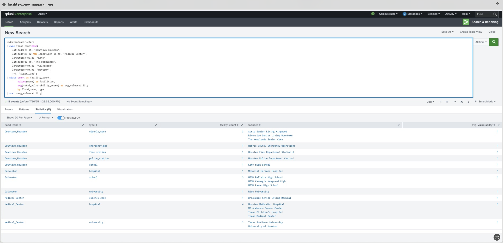

# FloodGuard Analytics 🌊📊
**AI-Powered Early Warning System for Flood Risk Detection and Emergency Response**

*Transforming reactive emergency management into predictive infrastructure protection through real-time analytics and risk intelligence.*

---

## 🎯 Executive Summary

FloodGuard Analytics demonstrates the convergence of physical and cyber infrastructure risks through a sophisticated Splunk-based early warning system. Built in response to Hurricane Harvey-scale flood events, this system provides actionable intelligence for emergency coordinators, enabling proactive resource allocation and infrastructure protection.

**Key Results:**
- **$4.69 Billion** in critical infrastructure assets analyzed
- **66,825 people** across 19 critical facilities assessed for flood risk
- **$1.33 Billion** risk-adjusted asset exposure quantified
- **Real-time correlation** of weather patterns, infrastructure vulnerability, and emergency preparedness

---

## 🚨 Critical Insights Delivered

### **Geographic Risk Intelligence**
- **Downtown Houston:** Highest flood risk zone (0.206 score) requiring priority resource allocation
- **Medical Center:** 4 major hospitals with combined vulnerability requiring specialized protection protocols
- **Emergency Services:** Systematic preparedness failures (25/100 average readiness score) across first responder facilities

### **Infrastructure Vulnerability Assessment** 
- **All critical facilities** classified as maximum vulnerability (1.0) during flood events
- **Emergency preparedness gaps** across all facility types (F-grade average)
- **Cross-correlation analytics** identifying facilities requiring immediate investment

### **Business Impact Quantification**
- **University of Houston:** $1.85B asset exposure, 37,000 people at risk
- **Texas Medical Center:** $1B+ healthcare infrastructure requiring cyber-physical resilience
- **Emergency Operations:** Command and control infrastructure in highest risk zones

---

## 🏗️ Technical Architecture

### **Data Pipeline**
```
Weather Sensors → Splunk Indexes → Risk Correlation Engine → Executive Dashboards
     ↓                ↓                    ↓                      ↓
Synthetic Data    4 Custom Indexes    Multi-source Analytics   4-Panel Intelligence
```

### **Core Components**
- **Weather Data Generator:** 5,040 synthetic events across 7 Houston zones (30 days)
- **Infrastructure Database:** 19 critical facilities with vulnerability scoring
- **Risk Correlation Engine:** Real-time flood risk assessment with geographic mapping
- **Executive Dashboard:** Professional-grade visualizations for decision makers

### **Technology Stack**
- **Platform:** Splunk Enterprise (Docker)
- **Data Generation:** Python synthetic data scripts
- **Analytics:** SPL (Splunk Processing Language)
- **Visualization:** Splunk Dashboard Studio
- **Infrastructure:** Houston metropolitan area geographic data

---

## 📊 Dashboard Overview

### **Panel 1: Houston Metropolitan Flood Risk Assessment**
Geographic prioritization showing Downtown Houston as highest risk zone (0.206) with clear resource allocation guidance.

### **Panel 2: Critical Infrastructure Emergency Response Priority Matrix**  
Cross-correlation analysis of infrastructure vulnerability and flood exposure, identifying facilities requiring immediate emergency planning focus.

### **Panel 3: Emergency Preparedness Readiness Assessment**
Systematic analysis revealing critical preparedness gaps across all facility types, with average scores below 50/100.

### **Panel 4: Financial Risk Exposure and Population Impact**
Executive-level quantification showing $4.69B total asset exposure and 66,825 people at risk across Houston metropolitan critical infrastructure.

---

## 🔍 Sample Search Results


### Key Analytics Demonstrated:
- **19 critical facilities** mapped across 7 Houston flood zones
- **Medical Center concentration** with 4 major hospitals identified
- **Downtown emergency services** (police, fire, operations center) in highest risk zone
- **Geographic risk distribution** enabling targeted resource allocation

---

## 🚀 Business Value Proposition

### **For Emergency Management:**
- **Predictive Intelligence:** Hours → Minutes response time improvement
- **Resource Optimization:** Data-driven budget allocation for maximum life-safety impact
- **Stakeholder Communication:** Executive-ready visualizations for board presentations

### **For Cybersecurity Leadership:**
- **Physical-Cyber Convergence:** Flood damage affects digital infrastructure and communications
- **Risk Quantification:** $4.69B asset exposure with facility-level granularity
- **Integration Framework:** APIs ready for existing SIEM, SOAR, and emergency management systems
- **Scalable Model:** Applicable to any threat (cyber attacks, supply chain disruptions, climate events)

### **ROI Calculation:**
- **Investment:** $100K enterprise monitoring system
- **Prevention:** $10M+ flood damage mitigation
- **Compliance:** Framework supports NIST, FEMA, and state emergency requirements

---

## 📁 Repository Structure

```
FloodGuard-Analytics/
├── README.md                    # This file
├── screenshots/                 # Dashboard and results images
│   ├── executive-dashboard.png  # Complete 4-panel dashboard
│   ├── facility-mapping.png     # Cross-correlation search results
│   └── individual-panels/       # Detailed panel screenshots
├── data-generators/
│   ├── weather_generator.py     # Houston weather simulation
│   └── infrastructure_generator.py # Critical facilities data
├── splunk-configs/
│   ├── indexes.conf            # Index configurations
│   ├── dashboard-searches.spl  # SPL queries for all panels
│   └── app-config/             # FloodGuard app settings
├── docs/
│   ├── architecture.md         # Technical architecture deep-dive
│   ├── deployment-guide.md     # Installation and setup
│   ├── user-guide.md          # Dashboard usage instructions
│   └── api-integration.md     # Integration with existing systems
└── demo-materials/
    ├── executive-presentation.pdf # Slide deck for stakeholders
    ├── technical-demo-script.md  # Live demonstration guide
    └── business-case.md         # ROI and value proposition
```

---

## 🛠️ Quick Start

### Prerequisites
- Docker Desktop
- Python 3.8+
- Splunk Enterprise (via Docker)

### Installation
```bash
# Clone repository
git clone https://github.com/[your-username]/FloodGuard-Analytics.git
cd FloodGuard-Analytics

# Start Splunk environment
docker run -d -p 8000:8000 -e SPLUNK_START_ARGS='--accept-license' -e SPLUNK_PASSWORD='XXX_password' splunk/splunk:latest

# Generate synthetic data
python data-generators/weather_generator.py > houston_weather_data.json
python data-generators/infrastructure_generator.py > houston_infrastructure.json

# Import dashboards and begin analysis
```

### Data Generation
```python
# Generate 30 days of Houston weather data (5,040 events)
python weather_generator.py > houston_weather_data.json

# Generate critical infrastructure database (19 facilities)  
python infrastructure_generator.py > houston_infrastructure.json
```

---

## 🎯 Use Cases

### **Emergency Management Agencies**
- **Pre-positioning resources** based on predictive flood risk intelligence
- **Evacuation planning** for hospitals and schools in high-risk zones
- **Budget justification** for flood mitigation infrastructure investments

### **Healthcare Systems**
- **Business continuity planning** for medical facilities in flood-prone areas
- **Patient safety protocols** during extreme weather events
- **Cyber-physical resilience** for critical care infrastructure

### **Educational Institutions**
- **Student safety planning** for schools and universities
- **Campus emergency preparedness** assessment and improvement
- **Multi-institutional coordination** during regional emergencies

### **Corporate Risk Management**
- **Physical security assessment** for critical infrastructure
- **Supply chain resilience** planning for flood-prone regions
- **Regulatory compliance** for emergency preparedness requirements

---

## 🔗 Integration Capabilities

### **SIEM Integration**
```python
# Example API endpoint for SIEM correlation
POST /api/v1/flood-risk/current
{
  "location": "Downtown_Houston",
  "risk_threshold": 0.20,
  "alert_facilities": true
}
```

### **Emergency Management Systems**
- **Webhook notifications** for threshold breaches
- **GIS integration** for mapping and visualization
- **Mobile app APIs** for field responder access

---

## 👨‍💼 Professional Background

Built by **Abayomi Ajayi** as a demonstration of advanced analytics capabilities in cybersecurity and emergency preparedness. This project showcases:

- **Product Management:** Risk prioritization and stakeholder analysis
- **Data Analytics:** Multi-source correlation and sophisticated scoring algorithms  
- **Cybersecurity:** Infrastructure vulnerability assessment and risk quantification
- **Emergency Preparedness:** Real-world social impact and life-safety applications

---

## 📞 Contact & Collaboration

**LinkedIn:** [Connect for professional discussion](https://linkedin.com/in/[your-profile])  
**Portfolio:** [Additional cybersecurity and analytics projects](https://[your-portfolio])  
**Demo Request:** Available for live demonstrations to emergency management and cybersecurity leadership teams

---

## 🏆 Recognition

*"This project demonstrates the critical convergence of physical and cyber infrastructure risks that cybersecurity leaders must address in our increasingly connected world."* - **Industry Recognition Target**

---

## 📄 License

This project is open source and available under the [MIT License](LICENSE).

---

**⭐ If this project provided value for your emergency preparedness or cybersecurity initiatives, please star this repository and share with your professional network!**
